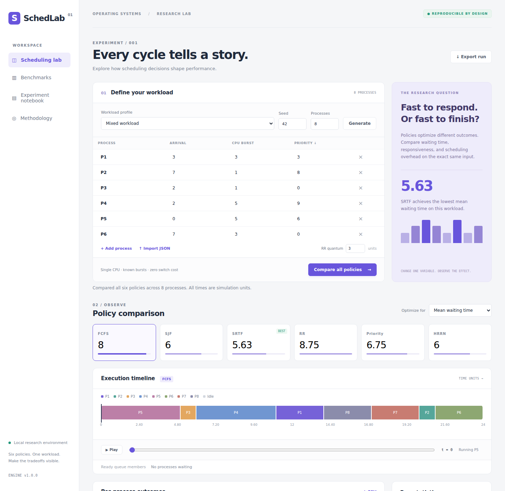
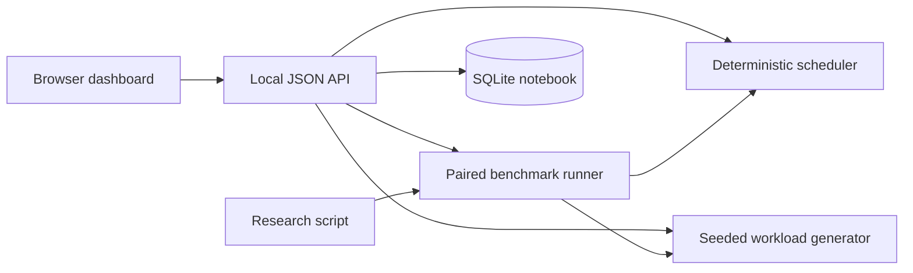

# SchedLab

**A CPU scheduling research dashboard built as an extension of an existing open-source operating-systems simulator.**

Compare six scheduling policies, replay execution, save experiments, and measure tradeoffs over repeatable workloads. Designed as a CS capstone foundation with implementation, evaluation data, tests, and a defense guide.



## Start in one command

Requirements: **Python 3.11 or newer** and a modern browser. The web application has **no third-party Python dependencies**.

```bash
python3 -m schedlab.server
```

Open **http://127.0.0.1:8080**. On Windows, use `py -m schedlab.server` if `python3` is unavailable. To choose another port: `python3 -m schedlab.server --port 8085`.

The server binds only to the local computer. SQLite experiments are created in `data/experiments.sqlite3` and excluded from Git. This is a local educational application, not a hosted multi-user service.

## Upstream and original contribution

This project follows [SorawitChok/Process-Scheduling-Simulation-Project](https://github.com/SorawitChok/Process-Scheduling-Simulation-Project), starting at commit [`f7b2f98`](https://github.com/SorawitChok/Process-Scheduling-Simulation-Project/commit/f7b2f98fa4fd5875dd443414b1d05fc18500459a). Its Git history, `simulator.py`, images, and MIT license are preserved. The original README is archived at [docs/UPSTREAM_README.md](docs/UPSTREAM_README.md).

| Original project | SchedLab extension |
|---|---|
| Tkinter/Turtle desktop interface | Responsive browser dashboard and local JSON API |
| FCFS, SJF, preemptive SJF, RR | Those policies plus non-preemptive Priority and HRRN |
| Scheduling coupled to animation and global state | Separate deterministic simulation engine |
| Manual workload entry | Up to 100 jobs, seeded generators, JSON import/export |
| Single-run metrics | Six-policy comparison, repeated paired benchmarks, raw samples |
| Absolute-start response calculation in `Respond` | Arrival-relative response metric, with a regression test |
| Desktop visualization | Timeline scrubbing, playback, per-process outcomes |
| No saved research notebook | SQLite storage, reproducible settings, CSV exports |

The new web engine is independently implemented; the original desktop engine remains available for comparison. Attribution is not a claim that the upstream authors wrote or endorse the extension. See [provenance](docs/PROVENANCE.md) for the exact boundary.

## Features

- **Six policies:** FCFS, SJF, SRTF, Round Robin, non-preemptive Priority, HRRN.
- **Four synthetic workload profiles:** mixed, batch, short jobs, and convoy effect.
- **Interactive results:** policy cards, Gantt timeline, time scrubber, waiting-process membership, process-level metrics.
- **Measurements:** waiting, turnaround, response, slowdown, p95 and max waiting, CPU utilization, throughput, context switches.
- **Reproducible benchmarks:** shared workloads across algorithms, consecutive seeds, mean and sample standard deviation.
- **Experiment notebook:** save, reload, JSON round-trip, per-process CSV.
- **Validation:** bounded integer inputs, unique process IDs, explicit tie-breaking and RR arrival semantics.

## Test and reproduce

```bash
python3 -m unittest discover -s tests -v
python3 -m scripts.research
```

The research command generates **1,440 policy measurements**: four workload profiles × three quantum settings × 20 seeds × six policies. Read [results](docs/results/RESULTS.md), [raw JSON](docs/results/benchmarks.json), and [CSV samples](docs/results/samples.csv).

Optional browser checks require Node.js 22+:

```bash
npm ci
npx playwright install chromium
npm run test:browser
```

Browser checks launch a temporary server and database, exercise the main workflows, and capture desktop/mobile screenshots. GitHub Actions runs unit/API tests on Python 3.11–3.14 and browser checks on Chromium.

## Architecture



```text
schedlab/             Simulation, experiments, HTTP API, persistence
web/                  Dashboard HTML, CSS, JavaScript
tests/                Algorithm, invariant, upstream, and HTTP tests
scripts/              Research reproduction and browser verification
docs/                 Capstone report, defense guide, attribution, results
simulator.py          Preserved upstream desktop application
img/                  Preserved upstream images
```

## Model assumptions

One CPU, integer time units, one known CPU burst per process, no I/O, zero switching cost, finite job sets. Lower priority numbers run first. Equal policy scores use arrival time, then input order. Round Robin enqueues arrivals through the quantum endpoint before requeuing the current process. Adjacent timeline segments for the same process are merged.

Utilization and throughput cover time zero through final completion, including initial idle time. A context switch means a transition between different running processes without an intervening idle interval; the initial dispatch does not count. See [the report](docs/REPORT.md) for formulas and limitations.

These synthetic experiments do not measure Linux/Windows scheduling performance. SJF/SRTF rely on advance burst knowledge. The dashboard lists ready-queue **members**, not their internal policy order. No universal best-policy claim follows from a selected workload.

## Graduation project materials

- [Project report and evaluation](docs/REPORT.md)
- [Ten-minute demo and defense questions](docs/DEFENSE.md)
- [Upstream provenance and changes](docs/PROVENANCE.md)
- [API examples](docs/API.md)
- [Contributing](CONTRIBUTING.md)

Suggested title: **“Reproducible Comparative Evaluation of CPU Scheduling Policies with an Interactive Experiment Platform.”** Confirm the scope with your department; this repository supplies a working implementation and evidence, not institutional graduation approval.

## Original desktop application

`python3 simulator.py` starts the preserved Tkinter/Turtle version. It requires a GUI display and a Python installation with Tk support; some Linux distributions package Tk separately. Its legacy behavior is retained for study and is not used by the web dashboard.

## License and references

MIT; original authors' notice is retained in [LICENSE](LICENSE). SchedLab additions are also MIT-licensed.

- Sorawit Chokphantavee, Sirawit Chokphantavee, Narinthorn Chinvorarat, Nathanon Rookheb: [upstream simulator](https://github.com/SorawitChok/Process-Scheduling-Simulation-Project).
- Remzi H. Arpaci-Dusseau and Andrea C. Arpaci-Dusseau: [Operating Systems: Three Easy Pieces, Scheduling: Introduction](https://pages.cs.wisc.edu/~remzi/OSTEP/cpu-sched.pdf).
- University of Wisconsin–Madison: [CS 537 scheduling notes](https://pages.cs.wisc.edu/~bart/537/lecturenotes/s11.html).
